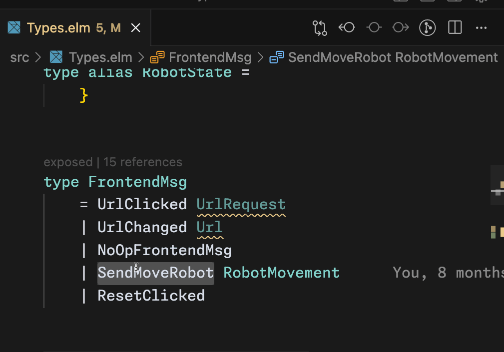

# 🔍 Next Occurrence Across Workspace

[](https://marketplace.visualstudio.com/items?itemName=charlontank.next-occurence-across-workspace)
[](https://marketplace.visualstudio.com/items?itemName=charlontank.next-occurence-across-workspace)
[](https://marketplace.visualstudio.com/items?itemName=charlontank.next-occurence-across-workspace&ssr=false#review-details)
[](https://github.com/CharlonTank/next-occurrence-across-workspace/blob/master/LICENSE)

> 🚀 **Quickly navigate through all occurrences of selected text across your entire workspace**

Ever wanted to jump between all instances of a variable, function, or text pattern across your entire project? This extension makes it simple and fast!

## 📑 Table of Contents

- [Features](#-features)
- [How to Use](#-how-to-use)
- [Configuration](#-configuration)
- [Requirements](#-requirements)
- [Keyboard Shortcuts](#-keyboard-shortcuts)
- [Tips](#-tips)
- [Known Issues](#-known-issues)
- [Release Notes](#-release-notes)

## ✨ Features

- 🔎 Jump to the **next occurrence** of selected text with `Alt+F`
- 🔍 Jump to the **previous occurrence** with `Alt+Shift+F`
- 📊 See match statistics in the status bar (e.g., "Match 3/12 for 'myFunction'")
- 🔄 Cycle through occurrences automatically - when you reach the end, it loops back to the beginning
- ⚙️ Configure directories and files to exclude from search
- 🔤 Case-insensitive search across all files
- 🖱️ Right-click context menu integration for finding occurrences
- 🧩 Robust .gitignore support with direct file parsing
- ⚡ Fast navigation through large codebases

## 📋 How to Use

1. **Select** any text in your editor

   ```js
   const myVariable = "Hello World";
   ```

2. Press `Alt+F` to find the next occurrence or `Alt+Shift+F` for the previous one

3. The extension will:
   - Find all matching occurrences across your entire workspace
   - Show a status indicator with the total number of matches
   - Navigate to the next/previous occurrence

4. Keep pressing the shortcuts to navigate through all matches

### Demo



## ⚙️ Configuration

You can customize the extension's behavior through VS Code settings:

### Accessing Settings

You can access settings in multiple ways:

1. Click the gear icon (⚙️) in the extension view
2. Click the gear icon in the status bar when using the extension
3. Use the command palette: `Next Occurrence Across Workspace: Open Settings`
4. Go to File > Preferences > Settings and search for "Next Occurrence"

### Exclude Patterns

Customize which files and directories to exclude from your searches:

```json
"nextOccurenceAcrossWorkspace.excludePatterns": [
  "**/node_modules/**",
  "**/dist/**",
  "**/package-lock.json",
  "**/*.min.js"
  // Add any glob pattern you want to exclude
]
```

You can add, remove, or modify patterns as needed. The patterns work with both directories and files.

If you want to restore the default settings, you can click the "Reset Setting" button in the settings UI.

### Git Integration

The extension provides robust .gitignore support:

```json
"nextOccurenceAcrossWorkspace.respectGitignore": true
```

When enabled, the extension parses all .gitignore files in your workspace and excludes any matching files from the search. The search status bar shows you how many files were excluded by .gitignore patterns.

### Hidden Files

Control whether to include hidden files in the search:

```json
"nextOccurenceAcrossWorkspace.includeHiddenFiles": false
```

## 🛠️ Requirements

- VS Code 1.95.0 or higher

## ⌨️ Keyboard Shortcuts

| Action | Shortcut |
|--------|----------|
| Find next occurrence | `Alt+F` |
| Find previous occurrence | `Alt+Shift+F` |

You can customize these in your keybindings.json file:

```json
[
  {
    "key": "alt+f",
    "command": "next-occurence-across-workspace.findNextOccurrence",
    "when": "editorTextFocus"
  },
  {
    "key": "alt+shift+f",
    "command": "next-occurence-across-workspace.findPreviousOccurrence",
    "when": "editorTextFocus"
  }
]
```

## 💡 Tips

- Works seamlessly with code, comments, strings, and any text content
- Great for refactoring when you need to check all instances of a function or variable
- Use it to navigate through code patterns or repeated text
- For large workspaces, be specific with your selection to reduce the number of matches
- Use context menu options by right-clicking on selected text
- When navigating between matches, the status bar shows your current position

## ⚠️ Known Issues

- Binary files and large files might be skipped to improve performance
- The search may take longer in large workspaces with many files

## 📝 Release Notes

### 0.0.12

- 🔧 Simplified exclude patterns into a single unified array setting
- ⚙️ Made exclude patterns fully customizable
- 🐛 Fixed "Reset Setting" functionality to properly restore default patterns
- 🔍 Implemented robust .gitignore support with direct file parsing
- 📊 Improved search status information with detailed file counts

### 0.0.11

- 📁 Added ability to exclude specific file types from search
- 🔧 Added option to respect .gitignore files when searching

### 0.0.10

- ⚙️ Added UI-based settings and command palette access
- 🖱️ Added context menu items for finding occurrences
- 🔧 Added configurable directory exclusion and hidden file options
- 🔤 Improved case-insensitive search and added related tests
- 🎨 Updated and added extension logo
- 🐛 Fixed navigation and search tracking issues

### 0.0.9

- 🔍 Added case-insensitive search functionality
- ⚙️ Improved settings configuration with UI-based controls
- 🖱️ Added context menu items for finding occurrences
- 🛠️ Added more default directories to exclude (elm-stuff, coverage, etc.)
- 📊 Enhanced status bar information

### 0.0.6

- 🐛 Fixed functionality issues with both next and previous occurrence navigation
- 🔄 Improved search and occurrence tracking
- 🎨 Added extension logo

---

**Enjoy!** 💻 If you find this extension helpful, please consider leaving a review or star on [GitHub](https://github.com/CharlonTank/next-occurrence-across-workspace).

## Following extension guidelines

Ensure that you've read through the extensions guidelines and follow the best practices for creating your extension.

- [Extension Guidelines](https://code.visualstudio.com/api/references/extension-guidelines)

## Working with Markdown

You can author your README using Visual Studio Code. Here are some useful editor keyboard shortcuts:

- Split the editor (`Cmd+\` on macOS or `Ctrl+\` on Windows and Linux).
- Toggle preview (`Shift+Cmd+V` on macOS or `Shift+Ctrl+V` on Windows and Linux).
- Press `Ctrl+Space` (Windows, Linux, macOS) to see a list of Markdown snippets.

## For more information

- [Visual Studio Code's Markdown Support](http://code.visualstudio.com/docs/languages/markdown)
- [Markdown Syntax Reference](https://help.github.com/articles/markdown-basics/)
